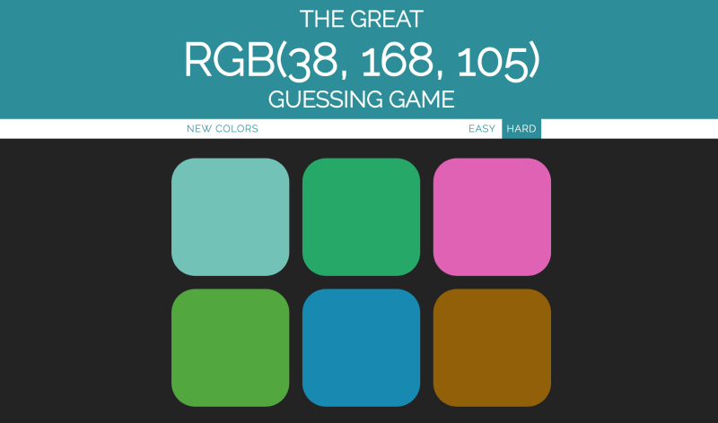

### 3: JAVASCRIPT ERRATE DIE FARBE SPIEL

Ein Farbratespiel mit JavaScript zu programmieren ist ganz einfach:

1.  Du erstellst ein Spiel, bei dem der Spieler einen einzelnen RGB-Wert für eine Farbe sieht.
2.  Der Spieler muss auf eine Farbe klicken, die seiner Meinung nach mit dem angezeigten RGB-Wert übereinstimmt.

Du kannst das Spiel leicht um weitere Funktionen erweitern, um es noch schwieriger zu machen.

Du könntest zum Beispiel die Anzahl der Vermutungen begrenzen oder dem Spieler drei "Leben" geben. Bei jedem falschen Tipp verliert er eines und das Spiel ist vorbei, wenn er kein Leben mehr hat.