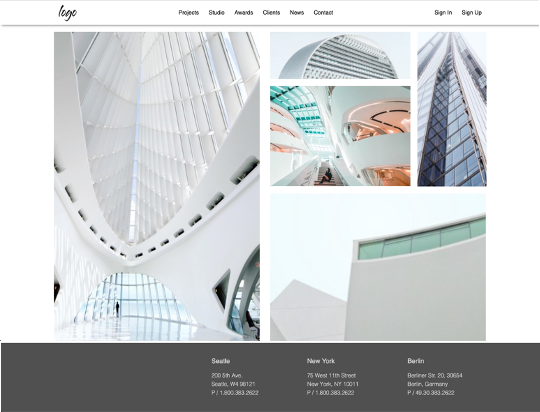

# Exercise for Flexbox

Single webpage about Flexbox

## Instructions

* Add a title to the document
* Use External CSS to style the document
* Please just code what you see, neither less nor more.
* It will be responsive and for mobile version breakpoint is 480px.

## The image overview

## The onlive version

In order to see live version, just [click...!](https://hsnakk.github.io/flexbox_exercise_2/)