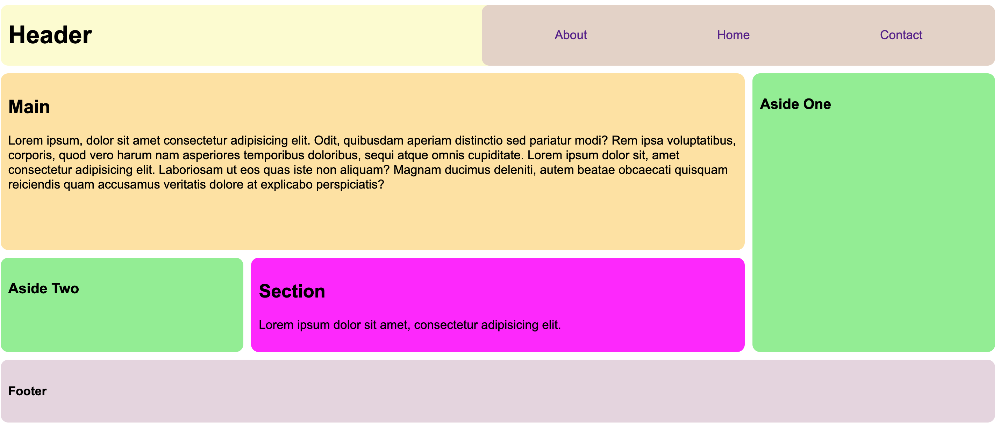

# Grid Meets Flexbox

Using `grid-template-areas` and `flex` for the navigation bar, recreate the reference image below.

- Style the page using `padding`, `gap`, different background colors, different font-families etc.

Good luck and have fun!
